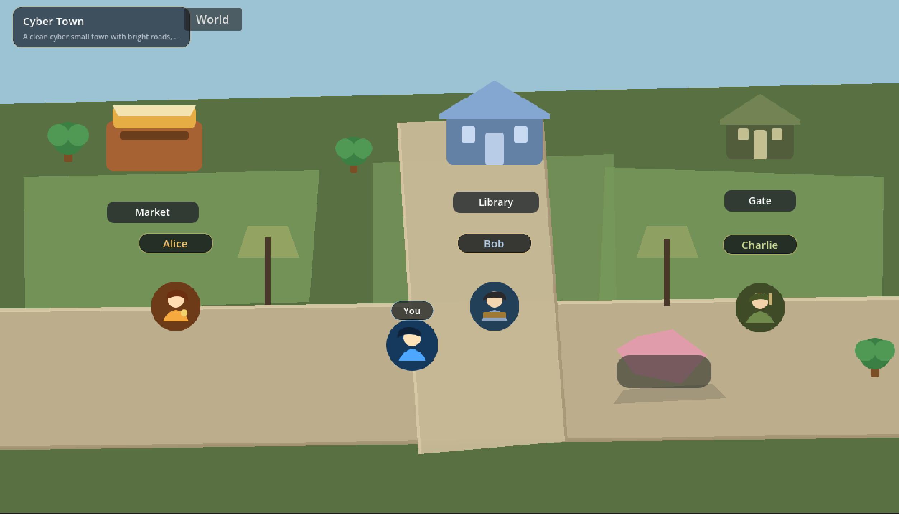
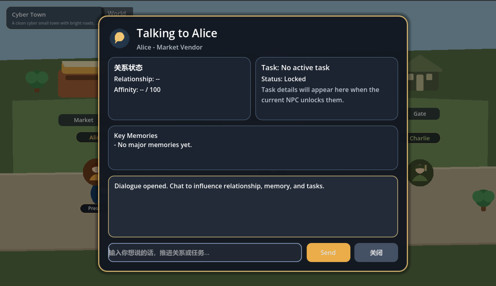

# Cyber Town

## 项目简介 🌆

Cyber Town 是一个基于 **Godot + FastAPI + LLM** 构建的 2D AI NPC 互动原型。

当前版本聚焦于“小而完整”的可交互体验：玩家可以在小镇中移动、与多个 NPC 交谈，并体验带有角色设定、短期记忆、长期记忆、关系状态、任务系统的 AI 对话流程。项目同时预留了 **world / scene 配置扩展能力**，后续可以继续推进“玩家定义世界”“AI 自动生成头像 / 建筑 / 场景素材”等方向。

它不是一个已经完成商业化内容生产的游戏，而是一个面向作品集、原型验证和 AI 游戏交互探索的可运行项目。

## 核心功能 ✨

### 1. 玩家移动与场景交互
- 使用 `WASD` 在小镇中移动
- 靠近 NPC 后可通过 `E` 触发对话
- 当前场景包含市场区、图书馆区、守卫区等基础小镇分区

### 2. 多 NPC 对话
- 支持多个独立 NPC
- 当前主要角色：
  - `Alice`
  - `Bob`
  - `Charlie`
- 每个 NPC 均支持独立的人设、关系、记忆和任务状态

### 3. 基于 LLM 的角色化回复
- 后端接入真实大语言模型 API
- 回复生成会结合：
  - NPC 角色设定
  - 当前世界设定
  - 最近几轮短期记忆
  - 检索到的长期记忆
  - 当前关系状态
  - 当前任务上下文

### 4. 短期记忆
- 为每个 NPC 单独维护最近几轮对话历史
- 用于保持当前上下文连贯，避免每轮都从零开始回复

### 5. 长期记忆
- 为每个 NPC 单独保存重要互动信息
- 长期记忆会持久化到本地 JSON 文件
- 重启后端后仍可继续检索并参与回复生成

### 6. 好感度 / 关系阶段系统
- 根据玩家输入内容用规则法更新关系值
- 支持关系阶段变化，例如：
  - `cold`
  - `guarded`
  - `neutral`
  - `warm`
  - `trusted`
- 当前关系阶段会影响 NPC 的回复语气

### 7. 任务系统
- 当前版本已实现最小可用的对话型任务
- 任务与关系阶段挂钩，支持：
  - 可接取
  - 进行中
  - 已完成
- 完成任务后会：
  - 提升好感度
  - 写入长期记忆
  - 在前端 UI 给出明确反馈

### 8. 前端可视化
- 对话面板可展示：
  - NPC 名称与角色
  - 关系阶段与好感度
  - 当前任务状态
  - 关键记忆摘要
- 场景内支持基础地图和角色展示

### 9. 世界设定可扩展能力
- 当前已加入最小可用的 **World Editor**
- 支持修改：
  - 场景标题
  - 场景主题
  - NPC 的 name / role / personality / speaking_style
  - avatar_prompt / building_prompt 等预留字段
- 支持预设世界一键切换：
  - `Cyber Town`
  - `Seaside Town`
  - `Magic Campus`

## 技术栈 🛠️

### 前端
- **Godot 4.x**
- **GDScript**
- 2D 场景搭建、UI 面板、角色交互逻辑

### 后端
- **Python**
- **FastAPI**
- REST API 负责 NPC 对话、世界配置、任务与状态更新

### AI 能力
- **LLM API**
- 基于 prompt 的角色化回复生成
- 结合世界设定、关系、记忆和任务上下文的对话生成

### 数据与状态
- 短期记忆：内存队列管理
- 长期记忆：JSON 持久化
- 世界配置：JSON 配置驱动
- 关系 / 任务：规则法状态更新

## 项目结构 📁

```text
Helloagents-AI-Town/
├── backend/
│   ├── main.py
│   ├── agents.py
│   ├── llm_client.py
│   ├── models.py
│   ├── memory_manager.py
│   ├── episodic_memory.py
│   ├── relationship_manager.py
│   ├── task_manager.py
│   ├── world_config.py
│   ├── config.py
│   ├── requirements.txt
│   ├── .env.example
│   ├── memory_data/
│   └── world_data/
└── helloagents-ai-town/
    ├── project.godot
    ├── scenes/
    │   ├── main.tscn
    │   ├── player.tscn
    │   ├── npc.tscn
    │   ├── dialogue_ui.tscn
    │   └── settings_panel.tscn
    ├── scripts/
    │   ├── main.gd
    │   ├── player.gd
    │   ├── npc.gd
    │   ├── dialogue_ui.gd
    │   ├── api_client.gd
    │   └── world_editor.gd
    └── assets/
        ├── characters/
        ├── map/
        └── ui/
```

## 运行方式 🚀

### 1. 后端启动

建议先创建并激活虚拟环境：

```powershell
python -m venv .venv
.\.venv\Scripts\Activate.ps1
```

安装依赖：

```powershell
cd backend
python -m pip install -r requirements.txt
```

启动 FastAPI：

```powershell
python -m uvicorn main:app --reload
```

默认地址：

```text
http://127.0.0.1:8000
```

### 2. 环境变量配置

后端使用 `backend/.env` 读取配置。可以先基于示例文件创建：

```powershell
copy .env.example .env
```

需要至少补充真实可用的 LLM 相关参数，例如：

```env
HOST=127.0.0.1
PORT=8000
LLM_API_KEY=your_api_key
LLM_BASE_URL=https://api.deepseek.com
LLM_MODEL=deepseek-chat
LLM_TIMEOUT=20
```

### 3. 前端运行

1. 使用 **Godot 4.x** 打开 `helloagents-ai-town/project.godot`
2. 确认 `ApiClient` 已注册为 AutoLoad
3. 运行 `scenes/main.tscn`

### 4. 前后端联调

- 先启动 FastAPI
- 再运行 Godot 项目
- 游戏内靠近 NPC 并按 `E`
- 在对话框中输入内容，即可触发真实后端对话链路

## 交互玩法说明 🎮

### 基础交互
- `WASD`：玩家移动
- `E`：与附近 NPC 交谈
- `World` 按钮：打开世界设定编辑面板

### 对话面板中可观察的内容
- 当前 NPC 名称与角色
- 好感度与关系阶段
- 当前任务状态
- 关键记忆摘要
- 对话记录

### 世界编辑能力
- 修改世界标题与主题
- 修改 3 个核心 NPC 的显示名、人设、说话风格
- 切换不同 world preset
- 当前配置保存后可再次加载

## 当前进展 📌

### 已完成
- Godot + FastAPI + LLM 的前后端真实闭环
- 多 NPC 互动与角色化回复
- 短期记忆系统
- 长期记忆系统（本地持久化）
- 好感度 / 关系阶段系统
- 任务系统
- 对话 UI 中的关系 / 任务 / 记忆可视化
- 小镇地图原型与基础场景美术
- 世界设定编辑与 preset 切换能力

### 正在优化
- 地图构图与 UI 排版细节
- 世界编辑面板体验
- 素材风格统一与正式美术替换

### 计划中
- 更丰富的世界编辑能力
- 玩家自定义更多 NPC
- AI 生成头像 / 建筑 / 场景素材
- 更完整的游戏化交互与状态反馈
- 更细粒度的任务与情绪系统

## 下一步规划 🔭

- 将当前占位美术逐步替换为统一风格的正式素材
- 继续完善 World Editor，使“玩家定义世界”更易用
- 扩展更多可编辑 NPC 设定和世界设定字段
- 接入 AI 生成场景 / 头像 / 建筑素材工作流
- 增加更完整的探索、收集、任务推进与状态变化

## 项目亮点💡

- 搭建了 **Godot + FastAPI + LLM** 的前后端联动 AI 互动原型
- 设计并实现了 NPC 的**角色设定、短期记忆、长期记忆、关系状态、任务系统**
- 通过**配置驱动**方式扩展世界观和人物设定，支持玩家动态修改世界
- 探索了 **AI 对话能力 + 游戏交互 + 世界配置编辑** 的原型结合方式
- 将 AI NPC 不仅做成“能回答问题”，而是推进到“有状态、有记忆、有关系变化”的可互动系统

## 效果展示 🖼️

### 小镇主场景





### 建议补充的展示内容

- 小镇主场景截图
- NPC 对话界面截图
- 关系 / 任务 / 记忆展示截图
- World Editor 面板截图

## 说明 📎

- 当前项目更偏向 **AI 游戏交互原型**，重点在于系统闭环与扩展能力，而不是完整商业化内容量
- 部分 UI、美术与编辑器体验仍在持续优化中
- 欢迎继续在此基础上扩展更多 NPC、地图区域与 AI 生成工作流
